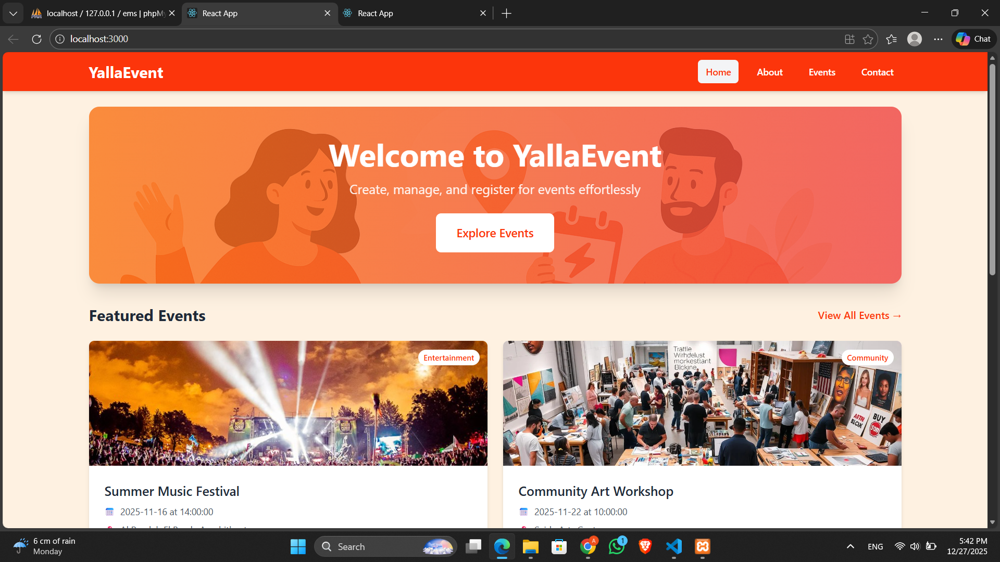
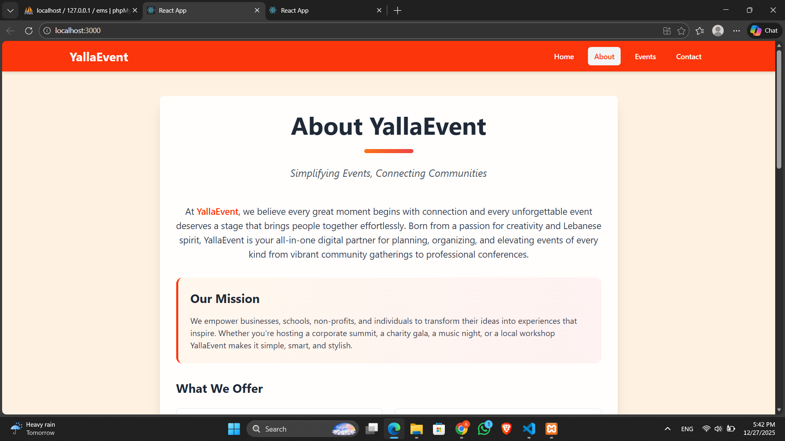
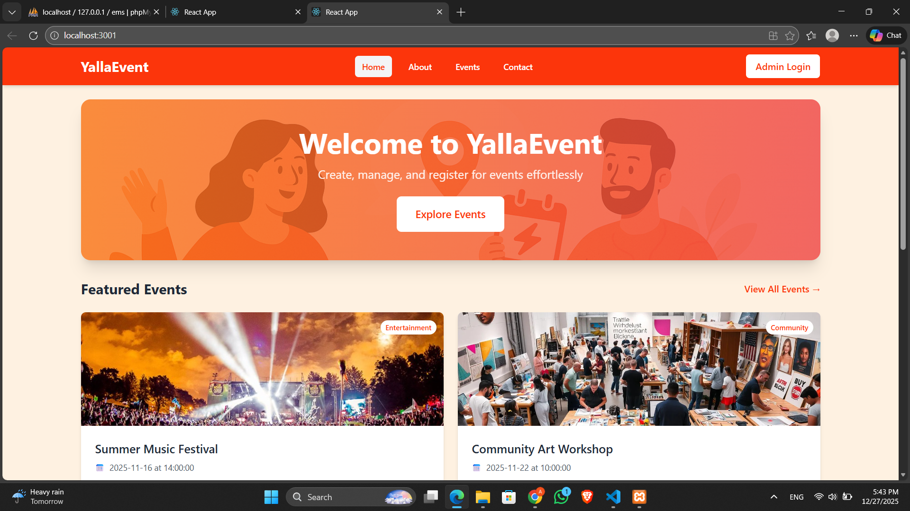
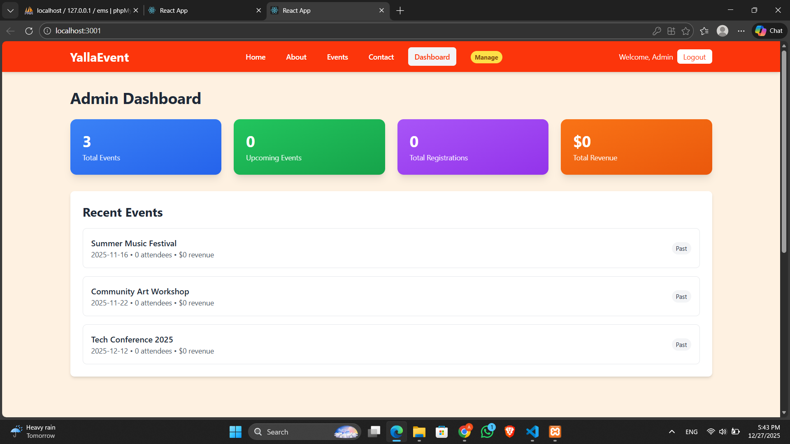

🎪 Event Management System (EMS)

📋 Project Overview
Event Management System (EMS) is a comprehensive full-stack web application designed to streamline event planning, management, and registration. The system features a dual-interface architecture with separate user and admin portals, providing secure role-based access to event management functionalities.

✨ Key Features
🎯 Dual Interface System: Separate user (port 3000) and admin (port 3001) applications

👥 Role-Based Access Control: Distinct permissions for users and administrators

📅 Event Lifecycle Management: Create, view, edit, delete events with image uploads

📝 Event Request System: Users can submit events for admin approval

📊 Real-time Dashboard: Admin statistics and analytics

📱 Mobile-Responsive Design: Built with Tailwind CSS for all devices

🔐 Secure Authentication: JWT-based admin authentication system

🚀 Quick Start Guide
📋 Prerequisites
Node.js (v14 or higher)

MySQL (v5.7 or higher)

npm or yarn package manager

Git for version control

🛠️ Installation Steps
1. Clone Repository
bash
git clone https://github.com/abdualla-cs/Event-Management-System.git
cd Event-Management-System
2. Database Setup
sql
-- Create database
CREATE DATABASE ems;

-- Import database schema (use the provided SQL dump)
-- Navigate to your MySQL console or use phpMyAdmin
3. Backend Setup (Port 5000)
bash
cd backend
npm install

# Create .env file with:
# DB_HOST=localhost
# DB_USER=root
# DB_PASSWORD=your_password
# DB_NAME=ems
# JWT_SECRET=your_secret_key
# PORT=5000

npm start
4. Frontend Setup
User Interface (Port 3000)
bash
cd frontend/user
npm install
npm start
Admin Interface (Port 3001)
bash
cd frontend/admin
npm install
npm start
🎯 Access Points
User Portal: http://localhost:3000

Admin Portal: http://localhost:3001

Backend API: http://localhost:5000

🔐 Default Credentials
Admin Access:

Email: abdalla@ems.org

Password: adminabdalla

📁 Project Structure
text
Event-Management-System/
├── 📁 backend/                                 # Node.js Backend Server
│   ├── 📄 server.js                           # Main Express server
│   ├── 📄 package.json                        # Backend dependencies
│   └── 📁 uploads/                            # Event image storage
│
├── 📁 frontend/                               # React Frontend Applications
│   ├── 📁 user/                               # User Interface (Port 3000)
│   │   ├── 📁 src/
│   │   │   ├── 📁 components/                 # Reusable UI components
│   │   │   ├── 📁 pages/                      # Page components
│   │   │   └── 📄 App.js                      # Main application
│   │
│   └── 📁 admin/                              # Admin Interface (Port 3001)
│       ├── 📁 src/
│       │   ├── 📁 components/                 # Admin-specific components
│       │   ├── 📁 pages/                      # Admin pages
│       │   ├── 📁 context/                    # State management
│       │   └── 📄 App.js                      # Admin application
│
└── 📄 README.md                               # Project documentation
🔧 Technology Stack
🖥️ Backend
Node.js - Runtime environment

Express.js - Web application framework

MySQL - Relational database

JWT - JSON Web Tokens for authentication

Multer - File upload handling

CORS - Cross-origin resource sharing

🎨 Frontend
React - UI library

Tailwind CSS - Utility-first CSS framework

Context API - State management

Axios - HTTP client

React Router - Navigation (simulated)

Material-UI Icons - Icon library

🛠️ Development Tools
Git - Version control

npm - Package management

phpMyAdmin - Database management

📊 Database Schema
📋 Core Tables
events - Main events table

registrations - Event registrations

pending_events - User-submitted event requests

contacts - Contact form submissions

admin_users - Administrator accounts

🔑 Key Relationships
Events ↔ Registrations (One-to-Many)

Events ↔ Pending Events (Approval workflow)

Admin authentication via JWT tokens

🎨 User Interface Screenshots
🏠 Home Page
https://via.placeholder.com/800x450.png?text=EMS+Home+Page

📅 Events Listing
https://via.placeholder.com/800x450.png?text=Events+Listing+Page

👤 User Event Request
https://via.placeholder.com/800x450.png?text=Event+Request+Form

🔧 Admin Dashboard
https://via.placeholder.com/800x450.png?text=Admin+Dashboard

📋 Pending Approvals
https://via.placeholder.com/800x450.png?text=Pending+Event+Approvals

🔐 API Endpoints
🎪 Events
text
GET    /api/events              # List all events
GET    /api/events/:id          # Get specific event
POST   /api/events              # Create event (admin)
PUT    /api/events/:id          # Update event (admin)
DELETE /api/events/:id          # Delete event (admin)
POST   /api/events/request      # Submit event request (user)
👥 Registrations
text
POST   /api/registrations       # Register for event
⚙️ Admin Operations
text
POST   /api/admin/login         # Admin authentication
GET    /api/admin/verify        # Token verification
GET    /api/admin/pending       # List pending events
POST   /api/admin/pending/:id/approve  # Approve event
POST   /api/admin/pending/:id/reject   # Reject event
DELETE /api/admin/pending/:id   # Delete pending event
📝 Key Code Implementations
🔑 Authentication Middleware
javascript
const authenticateToken = (req, res, next) => {
    const token = req.headers.authorization?.split(" ")[1];
    if (!token) return res.status(401).json({ error: "Access denied" });

    jwt.verify(token, process.env.JWT_SECRET, (err, user) => {
        if (err) return res.status(403).json({ error: "Invalid token" });
        req.user = user;
        next();
    });
};
🖼️ Event Creation with Image Upload
javascript
app.post("/api/events", authenticateToken, upload.single("image"), (req, res) => {
    const { name, date, time, location, category, description } = req.body;
    const image_filename = req.file ? req.file.filename : null;

    db.query(
        `INSERT INTO events (...) VALUES (?,?,?,?,?,?,?,?,?,'upcoming',NOW())`,
        [name, date, time, location, category, description, image_filename, ...],
        (err, result) => {
            if (err) return res.status(500).json(err);
            res.status(201).json({ success: true, eventId: result.insertId });
        }
    );
});
📊 Admin Dashboard Component
javascript
function DashboardPage({ events }) {
    const [stats, setStats] = useState({
        totalEvents: 0,
        upcomingEvents: 0,
        totalRegistrations: 0,
        totalRevenue: 0
    });

    return (
        

            <h1 className="text-3xl font-bold mb-6">Admin Dashboard</h1>
            

                <StatCard label="Total Events" value={stats.totalEvents} />
                <StatCard label="Upcoming Events" value={stats.upcomingEvents} />
                <StatCard label="Total Registrations" value={stats.totalRegistrations} />
                <StatCard label="Total Revenue" value={`$${stats.totalRevenue}`} />
            

        

    );
}
🔄 Role-Based Feature Comparison
Feature	👤 User	👑 Admin
Browse Events	✅	✅
View Event Details	✅	✅
Register for Events	✅	✅
Submit Contact Form	✅	✅
Request New Events	✅	✅
Create Events Directly	❌	✅
Edit/Delete Events	❌	✅
View Pending Requests	❌	✅
Approve/Reject Events	❌	✅
View Dashboard Statistics	❌	✅
View Contact Submissions	❌	✅
Manage All Registrations	❌	✅
🚀 Deployment
📦 Build for Production
bash
# Build backend
cd backend
npm run build

# Build frontend applications
cd frontend/user
npm run build

cd ../admin
npm run build
☁️ Deployment Options
Traditional Hosting: Upload to shared hosting with Node.js support

VPS/Dedicated Server: Full control deployment

Containerization: Dockerize for scalable deployment

Verify MySQL service is running

Check database credentials in .env file

Ensure database ems exists

Image Upload Issues

Check uploads/ directory permissions

Verify file size limits (5MB max)

Ensure correct MIME types

Admin Login Problems

Confirm default credentials

Check JWT secret configuration

Clear browser cache and localStorage

CORS Errors

Verify backend CORS configuration

Check API endpoint URLs

Ensure correct port configurations

React Build Errors

Update Node.js to v14+

Clear node_modules and reinstall

Check for conflicting dependencies

📈 Future Enhancements
🚀 Planned Features
🔔 Email Notifications - Event reminders and confirmations

💳 Payment Integration - Online ticket purchases

📱 Mobile App - Native iOS/Android applications

📊 Advanced Analytics - Detailed event insights

🤖 AI Recommendations - Personalized event suggestions

🌐 Multi-language Support - Internationalization

🔗 Social Media Integration - Event sharing and promotion

🔧 Technical Improvements
⚡ Performance Optimization - Code splitting and caching

🛡️ Enhanced Security - Rate limiting and input validation

📡 Real-time Features - WebSocket integration

🧪 Testing Suite - Comprehensive unit and integration tests

🐳 Docker Support - Containerized deployment

👥 Contributing
We welcome contributions! Please follow these steps:

Fork the repository

Create a feature branch: git checkout -b feature/amazing-feature

Commit your changes: git commit -m 'Add amazing feature'

Push to the branch: git push origin feature/amazing-feature

Open a Pull Request

📋 Contribution Guidelines
Follow existing code style and conventions

Add comments for complex logic

Update documentation accordingly

Test changes thoroughly

Ensure backward compatibility

📷UI Images

User UI

Admin UI (Same as User but there is some diffrences)

📄 License
This project is licensed under the MIT License - see the LICENSE file for details.

📞 Support & Contact
YallaEvent Management System
📍 Beirut, Al Hamra, Verdun Street
🏢 Crystal Center, 5th Floor, Office 502
📧 support@yallaevent.com
📞 +961 81 082 001

🌐 Social Media
Instagram: @yallaevent

Twitter: @yallaevent

Facebook: @yallaevent

LinkedIn: YallaEvent

🙏 Acknowledgments
React team for the amazing frontend library

Tailwind CSS for the utility-first CSS framework

Express.js team for the robust backend framework

MySQL community for reliable database management

All contributors who helped improve this project

Built with ❤️ and Lebanese spirit
© 2024 YallaEvent Management System. All rights reserved.

